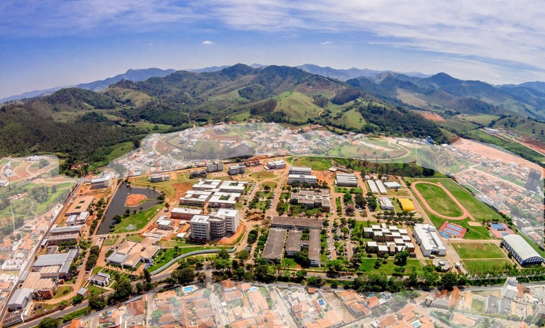

# IESTI05 - EDGE AI
## Edge Machine Learning Systems Engineering
**UPDATED to 2025 - 2nd Semester**

<figcaption><a href='https://unifei.edu.br/iesti/'>Federal University of Itajuba – UNIFEI - Campus de Itajubá, MG Brasil</a></figcaption>

## Material 
- Materials will be uploaded to this repo every week.
  - Slides, Notebooks, Code, and Docs in English 
  - Videos in Portuguese

### Optional pre-course activities:
<h3>Suggested Review</h3>

The students should be familiar with Embedded Machine Learning (TinyML).

<strong>For the students who have not previously attended the IESTI01 TinyML
    course</strong>, it is suggested to review the following classes before
  starting the IESTI05 course:

<ul>
  <li>Class 2 - Introduction to TinyML <a
      href="https://github.com/Mjrovai/UNIFEI-IESTI01-TinyML/blob/main/00_Curse_Folder/1_Fundamentals/Class_02/IESTI01_TinyML_class_2.pdf">[Slides]</a> <a
      href="https://github.com/Mjrovai/UNIFEI-IESTI01-TinyML/blob/main/00_Curse_Folder/1_Fundamentals/Class_02/docs">[Docs]</a> <a
      href="https://youtu.be/ozeL9a8xNXk" rel="nofollow">[Video]</a></li>
  <li>Class 3 - TinyML Challenges - Embedded Systems <a
      href="https://github.com/Mjrovai/UNIFEI-IESTI01-TinyML/blob/main/00_Curse_Folder/1_Fundamentals/Class_03/IESTI01_TinyML_class_3.pdf">[Slides]</a> <a
      href="https://github.com/Mjrovai/UNIFEI-IESTI01-TinyML/blob/main/00_Curse_Folder/1_Fundamentals/Class_03/docs">[Docs]</a> <a
      href="https://youtu.be/jumIhJMitSM" rel="nofollow">[Video]</a></li>
  <li>Class 4 - TinyML Challenges - Machine Learning <a
      href="https://github.com/Mjrovai/UNIFEI-IESTI01-TinyML/blob/main/00_Curse_Folder/1_Fundamentals/Class_04/IESTI01_TinyML_class_4.pdf">[Slides]</a> <a
      href="https://youtu.be/N1OWXpL4jMM" rel="nofollow">[Video]</a></li>
  <li>Class 9 - The Building Blocks of DL - DNN Recap, Datasets and Model
    Performance Metrics <a
      href="https://github.com/Mjrovai/UNIFEI-IESTI01-TinyML/blob/main/00_Curse_Folder/1_Fundamentals/Class_09/IESTI01_TinyML_class_9.pdf">[Slides]</a><a
      href="https://github.com/Mjrovai/UNIFEI-IESTI01-TinyML/blob/main/00_Curse_Folder/1_Fundamentals/Class_09">[Notebooks
      and Docs]</a> <a href="https://youtu.be/bQjIZc9iWhw"
      rel="nofollow">[Video]</a></li>
  <li>Class 10 - Introducing Convolutions (CNN) <a
      href="https://github.com/Mjrovai/UNIFEI-IESTI01-TinyML/blob/main/00_Curse_Folder/1_Fundamentals/Class_10/IESTI01_TinyML_class_10.pdf">[Slides]</a> <a
      href="https://github.com/Mjrovai/UNIFEI-IESTI01-TinyML/blob/main/00_Curse_Folder/1_Fundamentals/Class_10">[Docs]</a> <a
      href="https://youtu.be/swAs2-RuTpQ" rel="nofollow">[Video]</a></li>
  <li>Class 11 - Image Classification using CNN <a
      href="https://github.com/Mjrovai/UNIFEI-IESTI01-TinyML/blob/main/00_Curse_Folder/1_Fundamentals/Class_11/IESTI01_TinyML_class_11.pdf">[Slides]</a> <a
      href="https://github.com/Mjrovai/UNIFEI-IESTI01-TinyML/blob/main/00_Curse_Folder/1_Fundamentals/Class_11">[Notebooks
      and Docs]</a> <a href="https://youtu.be/GYGlD9mj7oo"
      rel="nofollow">[Video]</a></li>
  <li>Class 12 - Introduction to Edge Impulse – CNN with Cifar-10 <a
      href="https://github.com/Mjrovai/UNIFEI-IESTI01-TinyML/blob/main/00_Curse_Folder/1_Fundamentals/Class_12/IESTI01_TinyML_class_12.pdf">[Slides]</a> <a
      href="https://github.com/Mjrovai/UNIFEI-IESTI01-TinyML/blob/main/00_Curse_Folder/1_Fundamentals/Class_12">[Notebooks]</a> <a
      href="https://youtu.be/f0o8vkudAkc" rel="nofollow">[Video]</a></li>
  <li>Class 25 - Image Classification Introduction <a
      href="https://github.com/Mjrovai/UNIFEI-IESTI01-TinyML/blob/main/00_Curse_Folder/2_Applications_Deploy/Class_25/IESTI01_TinyML_class_25.pdf">[Slides]</a> <a
      href="https://github.com/Mjrovai/UNIFEI-IESTI01-TinyML/blob/main/00_Curse_Folder/2_Applications_Deploy/Class_25/docs">[Docs]</a> <a
      href="https://github.com/Mjrovai/UNIFEI-IESTI01-TinyML/blob/main/00_Curse_Folder/2_Applications_Deploy/Class_25">[Notebooks]</a> <a
      href="https://youtu.be/A6wdJzEXNzM" rel="nofollow">[Video]</a></li>
  <li>Class 26 - Image Classification using Edge Impulse Studio <a
      href="https://github.com/Mjrovai/UNIFEI-IESTI01-TinyML/blob/main/00_Curse_Folder/2_Applications_Deploy/Class_26/IESTI01_TinyML_class_26.pdf">[Slides]</a> <a
      href="https://youtu.be/x439ha4gg2g" rel="nofollow">[Video]</a></li>
</ul>

### Part 1: Fixed Function AI  
+ Class 1 - About the Course and Syllabus [[Slides]](00_Curso_Folder/1-Fixed_Function_AI/Class_01/1-Introduction_to_Edge_MLSys_Eng.pdf) [[Video]](https://youtu.be/HOwoKR1cu3I)
+ Class 2 - Introduction to Linux [[Slides]](00_Curso_Folder/1-Fixed_Function_AI/Class_02/2-Introduction_Linux.pdf) [[Docs]](00_Curso_Folder/1-Fixed_Function_AI/Class_02/docs/) [[Video]](https://youtu.be/iiBGlsGSiwY)
+ Class 3 - Raspberry_Pi-Setup_Walkthrough [[Slides]](00_Curso_Folder/1-Fixed_Function_AI/Class_03/3-Raspberry_Pi-Setup_Walkthrough.pdf) [[Docs]](00_Curso_Folder/1-Fixed_Function_AI/Class_03/docs/) [[Video]](https://youtu.be/uA69zZ67dgk)
+ Class 4 - Setup Python Environment [[Slides]](00_Curso_Folder/1-Fixed_Function_AI/Class_04/4-Setup_Python_env.pdf) [[Docs]](00_Curso_Folder/1-Fixed_Function_AI/Class_04/docs/) [[Video]](https://youtu.be/FYyjGTEflIo)

<h2>Course Summary</h2>

<strong>Edge AI Engineering with Raspberry Pi</strong> is a 15-week
  undergraduate course designed to teach students how to implement AI systems on
  edge devices, specifically using Raspberry Pi platforms.

The course is based on the e-book: <a
    href="https://mjrovai.github.io/EdgeML_Made_Ease_ebook/">"Edge AI
    Engineering" by Prof. Marcelo Rovai, UNIFEI 2025</a>

<h3><strong>Course Structure</strong></h3>

The course is divided into two main parts:

<ul>
  <li><strong>Part 1 (Weeks 1-7): Fixed Function AI</strong> - Focus on image
    classification and object detection</li>
  <li><strong>Part 2 (Weeks 8-15): Generative AI</strong> - Focus on Small
    Language Models (SLMs) and RAG systems</li>
</ul>

<h3><strong>Key Learning Areas</strong></h3>

<strong>Technical Skills:</strong>

<ul>
  <li>Raspberry Pi setup, configuration, and optimization</li>
  <li>Computer vision with OpenCV and TensorFlow Lite</li>
  <li>Image classification and object detection implementation</li>
  <li>Small Language Model deployment and integration</li>
  <li>Retrieval-Augmented Generation (RAG) systems</li>
  <li>Physical computing integration with sensors and actuators</li>
</ul>

<strong>Practical Applications:</strong>

<ul>
  <li>Real-time image processing and object detection</li>
  <li>Custom model training using Edge Impulse</li>
  <li>Building conversational AI systems on edge devices</li>
  <li>Creating intelligent IoT monitoring systems</li>
  <li>Natural language control of physical devices</li>
</ul>

<h3><strong>Assessment Structure</strong></h3>
<ul>
  <li><strong>40%</strong> - Weekly hands-on labs, quizzes and surveys</li>
  <li><strong>20%</strong> - Midterm project (Fixed Function AI system)</li>
  <li><strong>30%</strong> - Final project (Generative AI application)</li>
  <li><strong>10%</strong> - Participation and documentation</li>
</ul>

<h3><strong>Prerequisites</strong></h3>

Students need basic knowledge of Python programming, Linux systems, Deep
  Learning, and electronics fundamentals.

The course emphasizes practical, hands-on learning with students building
  real AI applications that run efficiently on resource-constrained edge
  devices, bridging the gap between traditional computer vision and modern
  generative AI technologies.

## Professor:
+ [Marcelo José Rovai](http://lattes.cnpq.br/4234592863079468)

## Supervision and support:
+ [José Alberto Ferreira](http://lattes.cnpq.br/8319509175327154)
